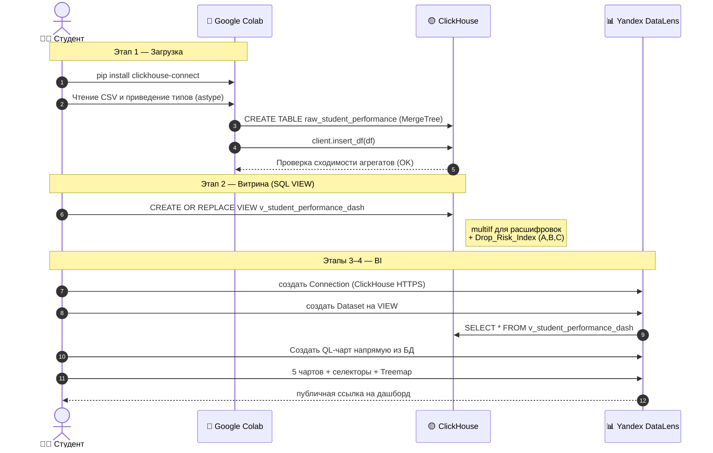

# Аналитика успеваемости школьников
**Цель занятия.** Научиться организовывать полный цикл образовательной аналитики (ELT-процесс). Вы загрузите сырые данные об успеваемости студентов с помощью Python, очистите и подготовите их средствами SQL в ClickHouse, а затем построите интерактивный дашборд в Yandex DataLens.

**Область исследования.** Факторы, влияющие на академическую успеваемость (GPA) старшеклассников (на основе синтетического датасета[Students Performance](https://www.kaggle.com/datasets/rabieelkharoua/students-performance-dataset/data)).

---

## Архитектура решения

Сценарий — классический **ELT** (Extract → Load → Transform → BI), плюс отдельная «реплика» в Jupyter для предпросмотра.

```mermaid
flowchart LR
    CSV[("Student_performance_data_.csv<br/>Kaggle")]:::src

    subgraph ELT["Этап 1. Загрузка"]
        PY["Google Colab<br/>(Python + pandas)"]
    end

    subgraph CH["Этап 2. ClickHouse"]
        direction TB
        RAW[("Сырая таблица<br/>(raw_student_performance)")]
        VIEW[/"Аналитическая витрина<br/>(SQL VIEW)"/]
        RAW --> VIEW
    end

    subgraph BI["Этап 3. DataLens"]
        direction TB
        CONN["Подключение"]
        CHARTS["Датасет / QL-чарт<br/>и Визуализации"]
        DASH["Интерактивный<br/>Дашборд"]
        CONN --> CHARTS --> DASH
    end

    USERS(["Студенты и Преподаватель"]):::user

    CSV ==>|"Upload"| PY
    PY ==>|"INSERT"| RAW
    VIEW ==>|"SELECT"| CONN
    DASH --> USERS

    classDef src fill:#fff3e0,stroke:#ef6c00,stroke-width:2px
    classDef user fill:#ede7f6,stroke:#5e35b1,stroke-width:1.5px
```



**Как читать схему.** Толстые стрелки (`==>`) — это «горячий» поток данных (CSV пошёл в Colab, оттуда в ClickHouse, оттуда в DataLens). Пунктирные стрелки — служебные связи: `Selectors → Dashboard` (это фильтрация, а не движение данных). Обратите внимание на QL-чарт: он работает напрямую от Connection, минуя Dataset.

---

## Поток данных во времени



---

## Технологический стек

| Слой | Что используем | Зачем именно это |
|---|---|---|
| **Источник данных** | CSV-файл «Students Performance Dataset» (Kaggle), `~2392 × 15` | Готовый датасет с понятной образовательной семантикой. |
| **Extract + Load** | Google Colab · `pandas` · `clickhouse-connect` | Colab выступает программным «коннектором» между вашим ноутбуком и ClickHouse, решая проблемы с файрволами. Добавлено жесткое приведение типов для безопасности. |
| **Хранилище (raw)** | ClickHouse · движок **MergeTree** · `ORDER BY StudentID` | OLAP-первичка с оптимальной типизацией: флаги в `UInt8`, метрики в `Float32`. |
| **Преобразование** | SQL · `CREATE OR REPLACE VIEW` · `multiIf` | Логический слой: материализации нет, но в BI приходит уже расшифрованная витрина. |
| **BI / визуализация** | Yandex DataLens · Dataset + **QL Charts** | Построение чартов через визуальный редактор (Датасет) и написание продвинутой аналитики прямым SQL-кодом (QL-чарт). |

---

## Этап 1. Загрузка данных через Google Colab (с проверкой качества)

Так как у вас нет прямого доступа к серверу СlickHouse для копирования файлов, мы будем использовать Python. В этом шаге мы не просто читаем CSV, но и **жестко приводим типы данных** к типам DDL (базы данных), чтобы избежать ошибок вставки.

1. Скачайте файл датасета `Student_performance_data _.csv` с Kaggle.
2. Загрузите файл в сессионное хранилище Google Colab.
3. Выполните следующий  или [скачать готовый скрипт тестирования дашборда](practice/pr_04/ch_student.ipynb):

```python
# 1. Установка библиотек
!pip install -q clickhouse-connect pandas numpy

import numpy as np
import pandas as pd
import clickhouse_connect

# 2. Чтение данных из CSV
csv_path = 'Student_performance_data _.csv'
df = pd.read_csv(csv_path)

# 3. Жесткое приведение типов под DDL базы данных ClickHouse
DDL_DTYPES = {
    'StudentID':         np.uint32,
    'Age':               np.uint8,
    'Gender':            np.uint8,
    'Ethnicity':         np.uint8,
    'ParentalEducation': np.uint8,
    'StudyTimeWeekly':   np.float32,
    'Absences':          np.uint8,
    'Tutoring':          np.uint8,
    'ParentalSupport':   np.uint8,
    'Extracurricular':   np.uint8,
    'Sports':            np.uint8,
    'Music':             np.uint8,
    'Volunteering':      np.uint8,
    'GPA':               np.float32,
    'GradeClass':        np.uint8,
}
df = df.astype(DDL_DTYPES)

# 4. Подключение к БД (замените данные на выданные вам!)
client = clickhouse_connect.get_client(
    host='95.131.149.21',
    port=8123,              # 8443 для HTTPS, 8123 для HTTP
    username='YOUR_USER',
    password='YOUR_PASSWORD',
    database='YOUR_DB',
    secure=False            # True, если используете HTTPS порт 8443
)

# 5. DDL сырой таблицы
DDL_RAW_TABLE = '''
CREATE TABLE IF NOT EXISTS raw_student_performance (
    StudentID UInt32,
    Age UInt8,
    Gender UInt8,
    Ethnicity UInt8,
    ParentalEducation UInt8,
    StudyTimeWeekly Float32,
    Absences UInt8,
    Tutoring UInt8,
    ParentalSupport UInt8,
    Extracurricular UInt8,
    Sports UInt8,
    Music UInt8,
    Volunteering UInt8,
    GPA Float32,
    GradeClass UInt8
) ENGINE = MergeTree()
ORDER BY StudentID;
'''
client.command(DDL_RAW_TABLE)

# Очистка и вставка
client.command('TRUNCATE TABLE raw_student_performance')
client.insert_df('raw_student_performance', df)

# 6. ВАЛИДАЦИЯ ЗАГРУЗКИ: проверяем, что данные доехали без потерь
ch_count = client.query('SELECT count() FROM raw_student_performance').result_rows[0][0]
print(f"Строк в CSV: {len(df)} | Строк в ClickHouse: {ch_count}")
assert ch_count == len(df), "Ошибка: Количество строк не совпадает!"
print("Успешно: Данные залиты корректно!")
```

---

## Этап 2. Создание аналитической витрины (SQL VIEW)

В сырой таблице переменные лежат числами (`Gender = 0`, `GradeClass = 4`). Для BI-системы мы переводим их в текст прямо внутри СУБД с помощью `multiIf`. Выполните скрипт в консоли БД или через Jupyter:

```sql
CREATE OR REPLACE VIEW v_student_performance_dash AS
SELECT
    StudentID, 
    Age, 
    StudyTimeWeekly, 
    Absences, 
    GPA,

    -- Расшифровка демографии
    multiIf(Gender = 0, 'Мужской',
            Gender = 1, 'Женский',
            'Неизвестно') AS Gender_Name,

    multiIf(Ethnicity = 0, 'Европеоидная',
            Ethnicity = 1, 'Афроамериканская',
            Ethnicity = 2, 'Азиатская',
            'Другая') AS Ethnicity_Name,

    -- Расшифровка образования родителей
    multiIf(ParentalEducation = 0, 'Нет',
            ParentalEducation = 1, 'Средняя школа',
            ParentalEducation = 2, 'Неоконченное высшее',
            ParentalEducation = 3, 'Бакалавр',
            ParentalEducation = 4, 'Магистр и выше',
            'Неизвестно') AS ParentalEdu_Name,

    -- Поддержка родителей
    multiIf(ParentalSupport = 0, 'Отсутствует',
            ParentalSupport = 1, 'Низкая',
            ParentalSupport = 2, 'Средняя',
            ParentalSupport = 3, 'Высокая',
            ParentalSupport = 4, 'Очень высокая',
            'Неизвестно') AS ParentalSupport_Name,

    -- Класс оценки (Переводим в шкалу A-F)
    multiIf(GradeClass = 0, 'A (Отлично)',
            GradeClass = 1, 'B (Хорошо)',
            GradeClass = 2, 'C (Удовлетворительно)',
            GradeClass = 3, 'D (Посредственно)',
            GradeClass = 4, 'F (Неудовлетворительно)',
            'Unknown') AS Grade_Name,

    -- Оставляем сырые флаги для математики в DataLens
    Tutoring, Extracurricular, Sports, Music, Volunteering,

    -- Текстовые версии для дашборда
    if(Tutoring = 1, 'Да', 'Нет') AS Has_Tutoring,
    if(Extracurricular = 1, 'Да', 'Нет') AS Has_Extracurricular

FROM raw_student_performance;
```

---

## Этап 3. Подключение и Создание QL-чарта в DataLens

DataLens поддерживает два режима создания чартов: через `Dataset` (визуальный drag-n-drop) и `QL-чарты` (написание прямого SQL кода к БД). Начнем с мощного инструмента — QL-чарта.

1. Зайдите в **Yandex DataLens**. Создайте **Подключение (Connection)** к вашему ClickHouse.
2. В левом меню нажмите **Создать → QL-чарт (QL Chart)**.
3. В качестве источника выберите **ваше Подключение** (не датасет!).
4. Вставьте следующий SQL-запрос. Он считает средний балл GPA и количество студентов в разрезе возраста и пола (то, что сложно сделать стандартными фильтрами Датасета):

```sql
SELECT 
    Age,
    Gender_Name,
    ROUND(AVG(GPA), 2) AS Avg_GPA,
    COUNT(StudentID) AS Students_Count
FROM v_student_performance_dash
GROUP BY Age, Gender_Name
ORDER BY Age, Gender_Name
```
5. Нажмите **Запустить**.
6. Слева в настройках чарта выберите тип: **Столбчатая диаграмма (Bar chart)**.
   * Ось X: `Age`
   * Ось Y: `Avg_GPA`
   * Цвета: `Gender_Name`
7. Сохраните чарт под именем `QL-Чарт: Средний GPA по возрасту и полу`.

---

## Этап 4. Формирование Датасета и Базовые Чарты

Теперь создадим датасет для остальных визуализаций:
1. Создайте **Датасет (Dataset)** на базе вашего подключения. Перетащите в рабочую область `v_student_performance_dash`.
2. Перейдите на вкладку "Поля". Добавьте метрики (расчетные поля):
   * **Всего студентов:** `COUNT([StudentID])`
   * **Средний GPA:** `AVG([GPA])`
   * **Средние прогулы:** `AVG([Absences])`
   * **Среднее время учебы:** `AVG([StudyTimeWeekly])`
   * **% с репетитором:** `AVG([Tutoring]) * 100`

Создайте 5 новых чартов из этого Датасета:

### Чарт 1. Индикаторы ключевых показателей (KPI)
*   **Тип:** Индикатор (Indicator).
*   **Показатель:** `Средний GPA` | **Доп. показатель:** `Всего студентов`.

### Чарт 2. Влияние поддержки родителей на оценки
*   **Тип:** Столбчатая диаграмма.
*   **Ось X:** `ParentalSupport_Name` | **Ось Y:** `Средний GPA` (Сортировка по убыванию Y).

### Чарт 3. Прогулы vs Успеваемость (Точечная диаграмма)
*   **Тип:** Точечная диаграмма (Scatter).
*   **Ось X:** `Absences` (без агрегации!) | **Ось Y:** `GPA` (без агрегации!).
*   **Цвет:** `Grade_Name`.

### Чарт 4. Распределение классов успеваемости
*   **Тип:** Кольцевая диаграмма (Donut).
*   **Цвет:** `Grade_Name` | **Показатель:** `Всего студентов` (подписи в %).

### Чарт 5. Влияние внеучебной активности на дисциплину
*   **Тип:** Столбчатая.
*   **Ось X:** `Has_Extracurricular` | **Ось Y:** `Средние прогулы`.

---

## Этап 5. Унифицированное практическое задание (Индекс Риска)

**Уважаемые слушатели!** Каждому из вас необходимо рассчитать свой уникальный показатель **Drop Risk Index (DRI)** внутри базы данных.

### Формула расчета Индекса Риска (DRI):

Зависит от вашего номера в списке группы ($N$, от 1 до 200). Вычислите $A$, $B$ и $C$:
*   $A = (N \bmod 5) + 1$
*   $B = (N \bmod 3) + 1$
*   $C = (N \bmod 4) + 1$

**Модификация VIEW:**

В DBeaver/DataGrip (или в Colab) выполните запрос `CREATE OR REPLACE VIEW v_student_performance_dash AS SELECT ...` (из Этапа 2), добавив в конец блока SELECT вашу уникальную строку:
```sql
    -- Уникальный показатель (подставьте вместо A, B, C ваши числа)
    (Absences * A) - (StudyTimeWeekly * B) + ((4.0 - GPA) * C * 10) AS Drop_Risk_Index
```

### Сборка дашборда и сдача работы:

1. В DataLens создайте **Дашборд**. Добавьте на него:
   * QL-чарт (из Этапа 3).
   * 5 базовых чартов (из Этапа 4).
   * **Селекторы (Selectors)**. `Gender_Name` и `Has_Tutoring` (привязать к Датасету).
2. Создайте последний (бонусный) чарт **Treemap (Древовидная диаграмма)**:
   *   **Измерения.** `ParentalEdu_Name` и `Ethnicity_Name`.
   *   **Показатели.** Средний `Drop_Risk_Index` (Avg).
   *   **Цвет.** Средний `Drop_Risk_Index` (градиент от зеленого к красному). Разместите его на дашборде.
3. **Результат работы:** 
   * Ссылка на блокнот Colab с кодом загрузки.
   * SQL код вашего VIEW с коэффициентами.
   * Публичная ссылка на дашборд Yandex DataLens.

*Критерий успешности: 

На дашборде работают все чарты (включая QL-чарт), интерактивная фильтрация через селекторы меняет графики, а на тепловой карте (Treemap) четко виден уникальный расчет вашего Индекса Риска.*
