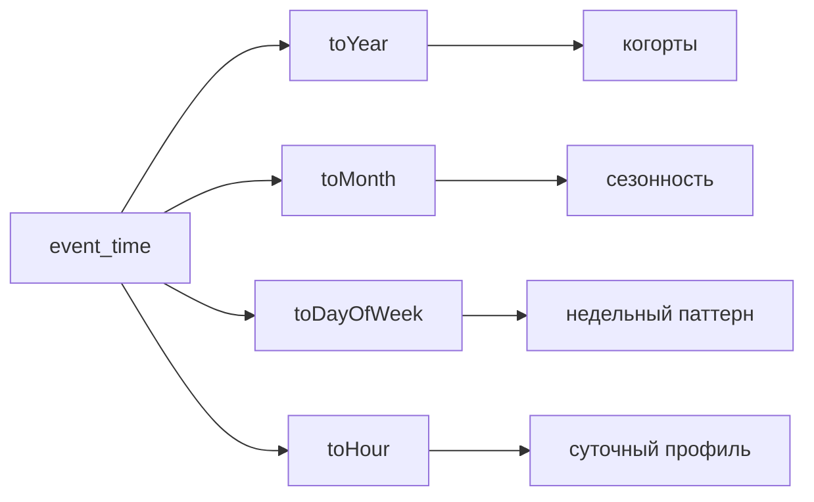
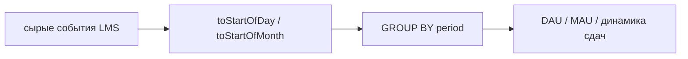
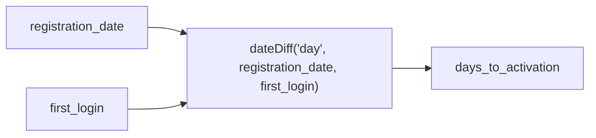
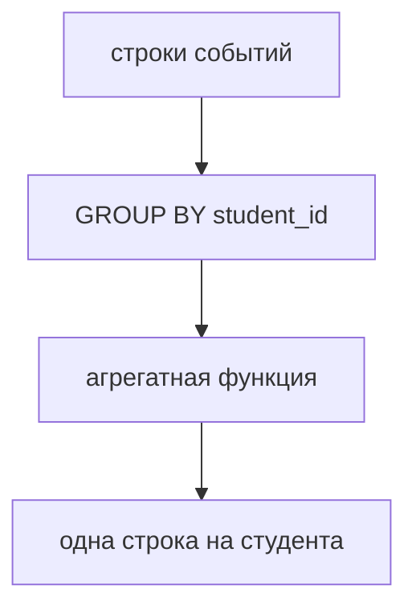
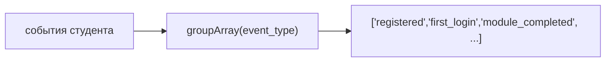

# 🎓 Функции ClickHouse в образовательной аналитике

## Цели занятия

После изучения этой лекции вы научитесь:
1. Извлекать части даты и времени: `toYear`, `toMonth`, `toDayOfWeek`, `toHour`.
2. Округлять временные метки для временных рядов: `toStartOfMonth`, `toStartOfDay`, `toStartOfHour`.
3. Считать интервалы между событиями через `dateDiff`.
4. Использовать мощные агрегатные функции: `argMax`, `argMin`, `uniq`, `uniqExact`, `groupArray`.
5. Анализировать образовательные траектории (массивы): `indexOf`, `arraySlice`, `has`, `hasAll`, `hasAny`.
6. Строить образовательные метрики: DAU, MAU, activation, completion, dropout-risk.

---

## Сквозной кейс и данные

Мы анализируем события LMS-платформы (Learning Management System). Основные типы событий:
* студент зарегистрировался (`registered`);
* впервые вошёл в систему (`first_login`);
* открывал и завершал модули (`module_completed`);
* отправлял тесты (`final_test_passed`);
* получил сертификат или ушёл в отток (`certificate_issued`, `warning`, `dropout`).

Все примеры ниже работают с одной таблицей: `lect_04_lms_events`.

<details>
<summary>🛠️ <b>Спойлер: SQL-код для создания таблицы (DDL) для самостоятельной практики</b></summary>

```sql
CREATE TABLE IF NOT EXISTS lect_04_lms_events (
    event_id UInt32,
    student_id UInt32,
    course_id String,
    module_id String,
    event_type String,
    event_time DateTime,
    score Nullable(Float32),
    time_spent_min UInt16,
    registration_date Date,
    birth_date Date
)
ENGINE = MergeTree()
ORDER BY (course_id, student_id, event_time, event_id);
```
*(Для воспроизведения примеров наполните таблицу синтетическими логами, описывающими прохождение студентами модулей).*
</details>

---

## Блок A. Функции работы с датой и временем

В LMS почти каждое событие имеет временную метку `event_time`. Наша задача — превратить `DateTime` в аналитические признаки: год, месяц, день недели, час.



### Пример. Извлечение компонентов времени
```sql
SELECT
    event_id,
    student_id,
    event_type,
    event_time,
    toYear(event_time) AS year,
    toMonth(event_time) AS month,
    toDayOfWeek(event_time) AS day_of_week,
    toHour(event_time) AS hour
FROM lect_04_lms_events
ORDER BY event_time
LIMIT 5;
```

### Пример А1. Суточный профиль активности
В какие часы студенты чаще всего работают с LMS?
```sql
SELECT
    toHour(event_time) AS hour,
    count() AS events,
    uniq(student_id) AS active_students
FROM lect_04_lms_events
WHERE event_type != 'registered'
GROUP BY hour
ORDER BY hour;
```

> ### 🧩 Задание A1
> Посчитайте количество событий по дням недели. Используйте `toDayOfWeek(event_time)` и `GROUP BY`.

<details>
<summary>👀 <b>Показать решение</b></summary>

```sql
SELECT
    toDayOfWeek(event_time) AS day_of_week,
    count() AS events
FROM lect_04_lms_events
GROUP BY day_of_week
ORDER BY day_of_week;
```
</details>

---

## Блок B. Округление даты и времени

Функции `toStartOf...` нужны, когда мы строим **временной ряд** (Time Series). Они отбрасывают лишнюю точность, округляя время до начала нужного периода.



### Пример B1. DAU (Daily Active Users)
Метрика показывает количество уникальных активных студентов за день. Для быстрой аналитики используем `uniq(student_id)`, для строгой отчётности — `uniqExact(student_id)`.

```sql
SELECT
    toStartOfDay(event_time) AS day,
    uniq(student_id) AS dau
FROM lect_04_lms_events
WHERE event_type NOT IN ('registered')
GROUP BY day
ORDER BY day;
```

> ### 🧩 Задание B1
> Постройте **MAU** — число уникальных активных студентов по месяцам. Используйте `toStartOfMonth(event_time)`.

<details>
<summary>👀 <b>Показать решение</b></summary>

```sql
SELECT
    toStartOfMonth(event_time) AS month,
    uniq(student_id) AS mau
FROM lect_04_lms_events
WHERE event_type != 'registered'
GROUP BY month
ORDER BY month;
```
</details>

---

## Блок C. `dateDiff`: интервалы между событиями

`dateDiff` возвращает количество **пересечённых границ** указанного интервала.
*Это важно: функция считает не «полные периоды», а именно календарные границы (переход через полночь, через границу месяца и т.д.).*



### Пример C1. Activation (время от регистрации до первого входа)
Для каждого студента найдём дату регистрации и дату первого входа (через `minIf`), а затем посчитаем разницу в днях.
```sql
SELECT
    student_id,
    min(registration_date) AS registration_date,
    minIf(event_time, event_type = 'first_login') AS first_login,
    dateDiff('day', min(registration_date), minIf(event_time, event_type = 'first_login')) AS days_to_activation
FROM lect_04_lms_events
GROUP BY student_id
ORDER BY student_id;
```

> ### 🧩 Задание C1
> Посчитайте **возраст студента на момент регистрации** (разницу между `birth_date` и `registration_date` в годах).  
> *Вопрос для обсуждения: почему такой возраст может отличаться от «полного биологического возраста»?*

<details>
<summary>👀 <b>Показать решение</b></summary>

```sql
SELECT
    student_id,
    min(birth_date) AS birth_date,
    min(registration_date) AS registration_date,
    dateDiff('year', min(birth_date), min(registration_date)) AS age_at_registration
FROM lect_04_lms_events
GROUP BY student_id
ORDER BY student_id;
```
*Ответ на вопрос:* `dateDiff` с аргументом `'year'` считает только пересечения 1 января. Человек, родившийся 31 декабря 2000 года и зарегистрировавшийся 2 января 2001 года, получит возраст "1 год", хотя ему всего 3 дня.
</details>

---

## Блок D. Агрегатные функции

Агрегации отвечают на вопрос: **что происходит в группе?**



### Пример D1. `argMax` и `argMin` (лучший и слабый модуль)
`argMax(arg, val)` возвращает тот аргумент `arg`, при котором значение `val` максимально.
```sql
SELECT
    student_id,
    argMax(module_id, score) AS best_module,
    max(score) AS best_score,
    argMin(module_id, score) AS weakest_module,
    min(score) AS weakest_score
FROM lect_04_lms_events
WHERE score IS NOT NULL
GROUP BY student_id;
```

### Пример D2. Комбинатор `-If`
Комбинаторы в ClickHouse позволяют считать сразу несколько сложных метрик за один проход по таблице.
```sql
SELECT
    uniqExact(student_id) AS total_students,
    uniqExactIf(student_id, event_type = 'first_login') AS activated_students,
    uniqExactIf(student_id, event_type = 'final_test_passed') AS finished_students,
    countIf(event_type = 'dropout') AS dropouts,
    round(avgIf(score, event_type = 'final_test_passed'), 2) AS avg_final_score
FROM lect_04_lms_events;
```

> ### 🧩 Задание D1
> Посчитайте по каждому студенту:
> 1. общее время обучения: `sum(time_spent_min)`
> 2. средний балл: `avg(score)`
> 3. число завершённых модулей: `countIf(event_type = 'module_completed')`  
> Отсортируйте результат по убыванию общего времени обучения.

<details>
<summary>👀 <b>Показать решение</b></summary>

```sql
SELECT
    student_id,
    sum(time_spent_min) AS total_time_spent,
    avg(score) AS average_score,
    countIf(event_type = 'module_completed') AS completed_modules
FROM lect_04_lms_events
GROUP BY student_id
ORDER BY total_time_spent DESC;
```
</details>

---

## Блок E. `groupArray`: траектория студента

Функция `groupArray` собирает значения в массив. Для образовательной аналитики это лучший способ получить упорядоченную **траекторию обучения** пользователя.



### Пример E1. `indexOf` и `arraySlice`
`indexOf` вернет индекс элемента в массиве (начинается с 1). Если не найдено — вернёт 0.  
`arraySlice` позволяет "отрезать" кусок массива (например, посмотреть первые или последние действия).

```sql
WITH trajectories AS (
    SELECT
        student_id,
        groupArray(event_type) AS events
    FROM (
        SELECT * FROM lect_04_lms_events ORDER BY student_id, event_time
    )
    GROUP BY student_id
)
SELECT
    student_id,
    events,
    indexOf(events, 'final_test_passed') AS final_test_step,
    arraySlice(events, 1, 3) AS first_three_events,
    arraySlice(events, -2) AS last_two_events
FROM trajectories;
```

> ### 🧩 Задание E1
> Для каждого студента получите:
> 1. массив `modules`
> 2. первый открытый модуль `modules[1]`
> 3. последние два модуля через `arraySlice(modules, -2)`.

<details>
<summary>👀 <b>Показать решение</b></summary>

```sql
WITH trajectories AS (
    SELECT
        student_id,
        groupArray(module_id) AS modules
    FROM (
        SELECT * FROM lect_04_lms_events 
        ORDER BY student_id, event_time, event_id
    )
    GROUP BY student_id
)
SELECT
    student_id,
    modules,
    modules[1] AS first_module,
    arraySlice(modules, -2) AS last_two_modules
FROM trajectories
ORDER BY student_id;
```
</details>

---

## Блок F. Поиск элементов в массивах

Функции для проверки наличия элементов в массиве возвращают `1` (Истина) или `0` (Ложь).

| Функция | Вопрос |
|---|---|
| `has(array, x)` | Есть ли один конкретный элемент? |
| `hasAll(array, [x, y])` | Есть ли **все** элементы из списка? |
| `hasAny(array, [x, y])` | Есть ли **хотя бы один** элемент? |

### Пример F1. Сегментация студентов на лету
```sql
WITH trajectories AS (
    SELECT
        student_id,
        groupArray(module_id) AS modules,
        groupArray(event_type) AS events
    FROM (SELECT * FROM lect_04_lms_events ORDER BY event_time)
    GROUP BY student_id
)
SELECT
    student_id,
    hasAll(modules, ['M1', 'M2', 'M3']) AS completed_core,
    hasAny(modules, ['ADV1', 'ADV2']) AS advanced_track,
    has(events, 'certificate_issued') AS received_certificate,
    hasAny(events,['warning', 'dropout']) AS risk_signal
FROM trajectories;
```

> ### 🧩 Задание F1
> Найдите студентов, которые:
> 1. прошли `M1` и `M2`
> 2. **не** прошли `M3`
> 3. имеют хотя бы один сигнал риска (`warning` или `dropout`).  
> *(Это потенциальная группа для оперативного вмешательства преподавателя).*

<details>
<summary>👀 <b>Показать решение</b></summary>

```sql
WITH trajectories AS (
    SELECT
        student_id,
        groupArray(module_id) AS modules,
        groupArray(event_type) AS events
    FROM (SELECT * FROM lect_04_lms_events ORDER BY event_time)
    GROUP BY student_id
)
SELECT student_id
FROM trajectories
WHERE 
    hasAll(modules,['M1', 'M2']) = 1 
    AND has(modules, 'M3') = 0
    AND hasAny(events, ['warning', 'dropout']) = 1;
```
</details>

---

## 🏆 Итоговый кейс: Мини-дашборд курса

Соберём ключевые показатели курса (Воронку) в одном запросе с помощью агрегаций и комбинаторов:

```sql
WITH student_level AS (
    SELECT
        student_id,
        min(registration_date) AS registration_date,
        minIf(event_time, event_type = 'first_login') AS first_login_time,
        minIf(event_time, event_type = 'final_test_passed') AS final_test_time,
        countIf(event_type = 'certificate_issued') > 0 AS certified,
        countIf(event_type IN ('warning', 'dropout')) > 0 AS risk,
        maxIf(score, event_type = 'final_test_passed') AS final_score,
        sum(time_spent_min) AS total_time_spent_min
    FROM lect_04_lms_events
    GROUP BY student_id
)
SELECT
    count() AS total_students,
    countIf(first_login_time IS NOT NULL) AS activated_students,
    countIf(final_test_time IS NOT NULL) AS finished_students,
    sum(certified) AS certified_students,
    sum(risk) AS risk_students,
    round(avgIf(final_score, final_score IS NOT NULL), 2) AS avg_final_score,
    round(avgIf(dateDiff('day', registration_date, first_login_time), first_login_time IS NOT NULL), 2) AS avg_days_to_activation
FROM student_level;
```

---

## 📝 Контрольная работа

Попробуйте решить задачи самостоятельно, опираясь на пройденный материал лекции.

### Задание 1. Недельный профиль
Постройте распределение **уникальных активных студентов** (DAU/WAU паттерн) по дням недели.

<details>
<summary>👀 <b>Решение 1</b></summary>

```sql
SELECT 
    toDayOfWeek(event_time) AS week_day,
    uniq(student_id) AS unique_active_students
FROM lect_04_lms_events
WHERE event_type != 'registered'
GROUP BY week_day
ORDER BY week_day;
```
</details>

### Задание 2. Доля завершения
Посчитайте **долю (в процентах)** студентов, которые дошли до `final_test_passed` от общего числа зарегистрированных.

<details>
<summary>👀 <b>Решение 2</b></summary>

```sql
SELECT
    uniq(student_id) AS total_students,
    uniqIf(student_id, event_type = 'final_test_passed') AS finished_students,
    round((finished_students / total_students) * 100, 1) AS completion_rate_pct
FROM lect_04_lms_events;
```
</details>

### Задание 3. Траектория риска
С помощью массивов выведите массив `events` (все события) только для тех студентов, у которых в траектории встречается `warning` или `dropout`.

<details>
<summary>👀 <b>Решение 3</b></summary>

```sql
WITH student_tracks AS (
    SELECT 
        student_id,
        groupArray(event_type) AS track
    FROM (SELECT * FROM lect_04_lms_events ORDER BY event_time)
    GROUP BY student_id
)
SELECT 
    student_id, 
    track
FROM student_tracks
WHERE hasAny(track,['warning', 'dropout']);
```
</details>

### Задание 4. Скорость прохождения
Посчитайте **среднее количество дней**, за которое студенты доходят от `registration_date` до события `final_test_passed`. Учитывайте только тех, кто сдал финал!

<details>
<summary>👀 <b>Решение 4</b></summary>

```sql
WITH student_times AS (
    SELECT
        student_id,
        min(registration_date) AS reg_date,
        minIf(event_time, event_type = 'final_test_passed') AS final_time
    FROM lect_04_lms_events
    GROUP BY student_id
    HAVING final_time IS NOT NULL
)
SELECT
    round(avg(dateDiff('day', reg_date, final_time)), 1) AS avg_days_to_complete
FROM student_times;
```
</details>

### Задание 5. Продвинутый трек
Разделите студентов на 2 когорты: те, кто начал модули `ADV1` или `ADV2`, и те, кто не начинал. Сравните их средний балл за `final_test_passed`.

<details>
<summary>👀 <b>Решение 5</b></summary>

```sql
WITH advanced_flags AS (
    SELECT 
        student_id,
        hasAny(groupArray(module_id),['ADV1', 'ADV2']) AS is_advanced,
        maxIf(score, event_type = 'final_test_passed') AS final_score
    FROM lect_04_lms_events
    GROUP BY student_id
    HAVING final_score IS NOT NULL
)
SELECT 
    if(is_advanced = 1, 'Продвинутые', 'Обычные') AS cohort,
    count() AS students_count,
    round(avg(final_score), 1) AS avg_final_score
FROM advanced_flags
GROUP BY cohort;
```
</details>
```
