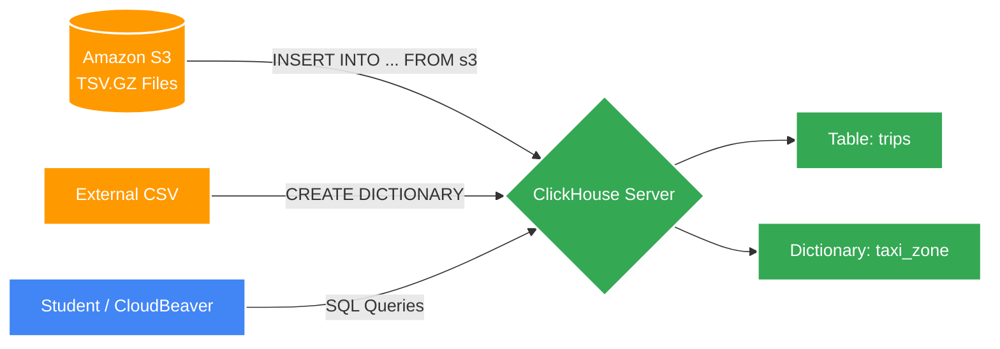

# Практическое занятие №2. Анализ данных в ClickHouse

## Постановка задачи
Целью данной работы является углубленное изучение аналитических возможностей ClickHouse на примере реального набора данных о поездках такси Нью-Йорка (более 1.9 млн записей). Студенту необходимо:
1.  Создать таблицу `trips` с оптимальной структурой.
2.  Загрузить данные из внешнего S3-хранилища.
3.  Выполнить серию аналитических запросов (агрегация, работа с датами, фильтрация).
4.  Создать и использовать внешний словарь для обогащения данных (JOIN и функции словарей).

---

## Архитектура решения




## Подключение к облачному серверу ClickHouse

Для выполнения заданий на общем сервере используйте следующие параметры подключения:

| Параметр | Значение |
|----------|----------|
| **Host** | `envlab.ru` |
| **Port** | `9191` |
| **Database** | Выдаётся лектором |
| **Username** | Выдаётся лектором |
| **Password** | Выдаётся лектором |

### Подключение через clickhouse-client

```bash
clickhouse-client --host envlab.ru --port 9191 --user ВАШ_ЛОГИН --password ВАШ_ПАРОЛЬ --secure
```

### Подключение через BI-инструменты

Для DBeaver, DataGrip, Metabase или Grafana укажите:

- **Host:** `envlab.ru`
- **Port:** `9191`
- **User / Password:** выданные лектором

### Подключение через веб-интерфейс

Если доступен HTTP-интерфейс, можно использовать встроенный SQL-редактор (ClickHouse Play / SQL Console) по адресу http://envlab.ru:9191

---

## Обзор и предварительные условия

В ходе выполнения лабораторной работы вы узнаете, как выполнять запросы данных в ClickHouse на примере набора данных о такси Нью-Йорка.

**Prerequisites:** для выполнения данного руководства необходим доступ к работающему сервису ClickHouse.

---

## Создание таблицы `trips`

Набор данных о такси Нью‑Йорка содержит сведения о миллионах поездок. Создайте таблицу для хранения этих данных в базе данных `default` (или вашей базе данных).

**Выполните в SQL-консоли следующий запрос:**

```sql
CREATE TABLE trips
(
    `trip_id` UInt32,
    `vendor_id` Enum8('1' = 1, '2' = 2, '3' = 3, '4' = 4, 'CMT' = 5, 'VTS' = 6, 'DDS' = 7, 'B02512' = 10, 'B02598' = 11, 'B02617' = 12, 'B02682' = 13, 'B02764' = 14, '' = 15),
    `pickup_date` Date,
    `pickup_datetime` DateTime,
    `dropoff_date` Date,
    `dropoff_datetime` DateTime,
    `store_and_fwd_flag` UInt8,
    `rate_code_id` UInt8,
    `pickup_longitude` Float64,
    `pickup_latitude` Float64,
    `dropoff_longitude` Float64,
    `dropoff_latitude` Float64,
    `passenger_count` UInt8,
    `trip_distance` Float64,
    `fare_amount` Float32,
    `extra` Float32,
    `mta_tax` Float32,
    `tip_amount` Float32,
    `tolls_amount` Float32,
    `ehail_fee` Float32,
    `improvement_surcharge` Float32,
    `total_amount` Float32,
    `payment_type` Enum8('UNK' = 0, 'CSH' = 1, 'CRE' = 2, 'NOC' = 3, 'DIS' = 4),
    `trip_type` UInt8,
    `pickup` FixedString(25),
    `dropoff` FixedString(25),
    `cab_type` Enum8('yellow' = 1, 'green' = 2, 'uber' = 3),
    `pickup_nyct2010_gid` Int8,
    `pickup_ctlabel` Float32,
    `pickup_borocode` Int8,
    `pickup_ct2010` String,
    `pickup_boroct2010` String,
    `pickup_cdeligibil` String,
    `pickup_ntacode` FixedString(4),
    `pickup_ntaname` String,
    `pickup_puma` UInt16,
    `dropoff_nyct2010_gid` UInt8,
    `dropoff_ctlabel` Float32,
    `dropoff_borocode` UInt8,
    `dropoff_ct2010` String,
    `dropoff_boroct2010` String,
    `dropoff_cdeligibil` String,
    `dropoff_ntacode` FixedString(4),
    `dropoff_ntaname` String,
    `dropoff_puma` UInt16
)
ENGINE = MergeTree
PARTITION BY toYYYYMM(pickup_date)
ORDER BY pickup_datetime;
```

---

## Добавление набора данных из S3

Загрузите данные о такси из сжатых файлов, хранящихся в облаке Amazon S3. Мы вставим примерно 2 000 000 строк из файлов `trips_1.tsv.gz` и `trips_2.tsv.gz`.

**Выполните запрос на вставку:**

```sql
INSERT INTO trips
SELECT * FROM s3(
    'https://datasets-documentation.s3.eu-west-3.amazonaws.com/nyc-taxi/trips_{1..2}.gz',
    'TabSeparatedWithNames', "
    `trip_id` UInt32,
    `vendor_id` Enum8('1' = 1, '2' = 2, '3' = 3, '4' = 4, 'CMT' = 5, 'VTS' = 6, 'DDS' = 7, 'B02512' = 10, 'B02598' = 11, 'B02617' = 12, 'B02682' = 13, 'B02764' = 14, '' = 15),
    `pickup_date` Date,
    `pickup_datetime` DateTime,
    `dropoff_date` Date,
    `dropoff_datetime` DateTime,
    `store_and_fwd_flag` UInt8,
    `rate_code_id` UInt8,
    `pickup_longitude` Float64,
    `pickup_latitude` Float64,
    `dropoff_longitude` Float64,
    `dropoff_latitude` Float64,
    `passenger_count` UInt8,
    `trip_distance` Float64,
    `fare_amount` Float32,
    `extra` Float32,
    `mta_tax` Float32,
    `tip_amount` Float32,
    `tolls_amount` Float32,
    `ehail_fee` Float32,
    `improvement_surcharge` Float32,
    `total_amount` Float32,
    `payment_type` Enum8('UNK' = 0, 'CSH' = 1, 'CRE' = 2, 'NOC' = 3, 'DIS' = 4),
    `trip_type` UInt8,
    `pickup` FixedString(25),
    `dropoff` FixedString(25),
    `cab_type` Enum8('yellow' = 1, 'green' = 2, 'uber' = 3),
    `pickup_nyct2010_gid` Int8,
    `pickup_ctlabel` Float32,
    `pickup_borocode` Int8,
    `pickup_ct2010` String,
    `pickup_boroct2010` String,
    `pickup_cdeligibil` String,
    `pickup_ntacode` FixedString(4),
    `pickup_ntaname` String,
    `pickup_puma` UInt16,
    `dropoff_nyct2010_gid` UInt8,
    `dropoff_ctlabel` Float32,
    `dropoff_borocode` UInt8,
    `dropoff_ct2010` String,
    `dropoff_boroct2010` String,
    `dropoff_cdeligibil` String,
    `dropoff_ntacode` FixedString(4),
    `dropoff_ntaname` String,
    `dropoff_puma` UInt16
") SETTINGS input_format_try_infer_datetimes = 0
```

> **Примечание:** дождитесь завершения выполнения команды `INSERT`. Загрузка 150 МБ данных может занять некоторое время.

**Проверка вставки:**
Выполните запрос для подсчета строк:
```sql
SELECT count() FROM trips;
```
Этот запрос должен вернуть **1 999 657** строк.

---

## Анализ данных

Выполните следующие аналитические запросы.

1.  **Средняя сумма чаевых:**
    ```sql
    SELECT round(avg(tip_amount), 2) FROM trips;
    ```

2.  **Средняя стоимость поездки в зависимости от количества пассажиров:**
    ```sql
    SELECT
        passenger_count,
        ceil(avg(total_amount),2) AS average_total_amount
    FROM trips
    GROUP BY passenger_count;
    ```

3.  **Ежедневное число посадок такси по районам:**
    ```sql
    SELECT
        pickup_date,
        pickup_ntaname,
        SUM(1) AS number_of_trips
    FROM trips
    GROUP BY pickup_date, pickup_ntaname
    ORDER BY pickup_date ASC;
    ```

4.  **Продолжительность поездки в минутах и группировка:**
    ```sql
    SELECT
        avg(tip_amount) AS avg_tip,
        avg(fare_amount) AS avg_fare,
        avg(passenger_count) AS avg_passenger,
        count() AS count,
        truncate(date_diff('second', pickup_datetime, dropoff_datetime)/60) as trip_minutes
    FROM trips
    WHERE trip_minutes > 0
    GROUP BY trip_minutes
    ORDER BY trip_minutes DESC;
    ```

5.  **Количество посадок такси в каждом районе с разбивкой по часам суток:**
    ```sql
    SELECT
        pickup_ntaname,
        toHour(pickup_datetime) as pickup_hour,
        SUM(1) AS pickups
    FROM trips
    WHERE pickup_ntaname != ''
    GROUP BY pickup_ntaname, pickup_hour
    ORDER BY pickup_ntaname, pickup_hour;
    ```

6.  **Поездки в аэропорты Ла‑Гуардия (LGA) или JFK:**
    ```sql
    SELECT
        pickup_datetime,
        dropoff_datetime,
        total_amount,
        pickup_nyct2010_gid,
        dropoff_nyct2010_gid,
        CASE
            WHEN dropoff_nyct2010_gid = 138 THEN 'LGA'
            WHEN dropoff_nyct2010_gid = 132 THEN 'JFK'
        END AS airport_code,
        EXTRACT(YEAR FROM pickup_datetime) AS year,
        EXTRACT(DAY FROM pickup_datetime) AS day,
        EXTRACT(HOUR FROM pickup_datetime) AS hour
    FROM trips
    WHERE dropoff_nyct2010_gid IN (132, 138)
    ORDER BY pickup_datetime;
    ```

---

## Работа со словарями

Словарь — это хранящееся в памяти отображение пар ключ-значение. Мы создадим словарь `taxi_zone_dictionary`, который сопоставляет коды районов с их названиями.

**Создание словаря:**
```sql
CREATE DICTIONARY taxi_zone_dictionary
(
  `LocationID` UInt16 DEFAULT 0,
  `Borough` String,
  `Zone` String,
  `service_zone` String
)
PRIMARY KEY LocationID
SOURCE(HTTP(URL 'https://datasets-documentation.s3.eu-west-3.amazonaws.com/nyc-taxi/taxi_zone_lookup.csv' FORMAT 'CSVWithNames'))
LIFETIME(MIN 0 MAX 0)
LAYOUT(HASHED_ARRAY());
```
> **Примечание.** Установка `LIFETIME` в 0 отключает автоматические обновления для экономии трафика.

**Проверка работы словаря:**
```sql
SELECT * FROM taxi_zone_dictionary;
-- Ожидается 265 строк.
```

### Функции для работы со словарем:

*   **dictGet:** Извлечение значения по ключу.
    ```sql
    SELECT dictGet('taxi_zone_dictionary', 'Borough', 132);
    -- Результат: Queens (аэропорт JFK).
    ```

*   **dictHas:** Проверка наличия ключа в словаре.
    ```sql
    SELECT dictHas('taxi_zone_dictionary', 132); -- Вернет 1 (true)
    SELECT dictHas('taxi_zone_dictionary', 4567); -- Вернет 0 (false)
    ```

*   **dictGetOrDefault:** Использование в сложном запросе (подсчет поездок в аэропорты по боро):
    ```sql
    SELECT
        count(1) AS total,
        dictGetOrDefault('taxi_zone_dictionary','Borough', toUInt64(pickup_nyct2010_gid), 'Unknown') AS borough_name
    FROM trips
    WHERE dropoff_nyct2010_gid = 132 OR dropoff_nyct2010_gid = 138
    GROUP BY borough_name
    ORDER BY total DESC;
    ```

---

## Выполнение соединений (JOIN)

В ClickHouse можно использовать привычный синтаксис `JOIN` для объединения таблиц со словарями.

1.  **Простой JOIN (аналог запроса выше):**
    ```sql
    SELECT
        count(1) AS total,
        Borough
    FROM trips
    JOIN taxi_zone_dictionary ON toUInt64(trips.pickup_nyct2010_gid) = taxi_zone_dictionary.LocationID
    WHERE dropoff_nyct2010_gid = 132 OR dropoff_nyct2010_gid = 138
    GROUP BY Borough
    ORDER BY total DESC;
    ```

2.  **JOIN для 1000 поездок с наибольшими чаевыми:**
    ```sql
    SELECT *
    FROM trips
    JOIN taxi_zone_dictionary
        ON trips.dropoff_nyct2010_gid = taxi_zone_dictionary.LocationID
    WHERE tip_amount > 0
    ORDER BY tip_amount DESC
    LIMIT 1000;
    ```
    > **Примечание.** как правило, в ClickHouse мы стараемся не использовать `SELECT *`. Рекомендуется извлекать только те столбцы, которые вам действительно нужны.

## Самостоятельная работа 

Каждый студент выполняет индивидуальное задание. Параметры определяются по формуле:

**Вариант $N$** = `(Порядковый_номер - 1) % 200 + 1`.

### Задание:
Напишите SQL-запрос, который выводит:
1.  **Название района (Borough)** из словаря.
2.  **Общее количество поездок** для этого района.
3.  **Среднюю стоимость поездки** (округленную до 2 знаков).

**Фильтрация данных по варианту:**
*   **Тип такси.** Если $N$ четный — `yellow`, если нечетный — `green`.
*   **Период.** Только поездки, совершенные в час $H$, где $H = N \pmod{24}$.
*   **Минимальная дистанция.** `trip_distance` > $(N \pmod{10})$.

---

## Защита практической работы и проверка знаний

Защита выполняется на платформе **envlab** в модуле «SQL для анализа данных».

| Программа обучения | Ссылка на курс | Практическая работа (Отчет) | Тренажер (CodeRunner) |
| :--- | :--- | :--- | :--- |
| **Дополнительное образование** | [Курс](https://envlab.ru/course/view.php?id=34) | — | [Тест 2 (Анализ)](https://envlab.ru/mod/quiz/view.php?id=1186) |
| **Бакалавриат: Бизнес-информатика** | [Курс (id=13)](https://envlab.ru/course/view.php?id=13) | [Загрузить отчет №2](https://envlab.ru/mod/assign/view.php?id=1141) | [Тест 5 (Анализ)](https://envlab.ru/mod/quiz/view.php?id=1142) |

